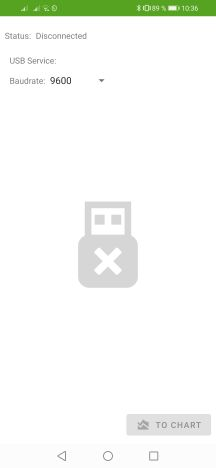
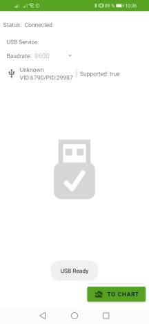
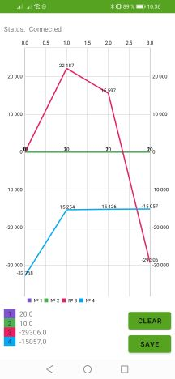
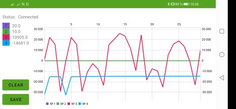
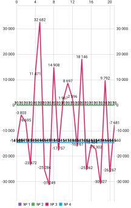
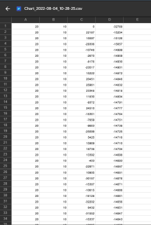

# Port Plotter for BGA rework stations

#### Построение графиков для самодельных паяльных станций на ардуино

# Инструкция

Минимальная версия Android  - 4.4

Для работы потребуется OTG USB кабель и поддержка OTG в смартфоне/планшете.

Первая версия приложения BGAPortPlotter не требует адаптации прошивок станции.

>Это касается тех станций, изначально имеющих возможность выводить отладочную информацию в PortPlotter на ПК.

Сразу после подключения станции к телефону (когда статус меняется на Connected) данные графика начинают записываться (если они поступают из станции), независимо от нахождения пользователя на экране с графиком.

Формат данных, приходящих из станции:

`$001 0020 030 033;`

В этом сообщении передается 4 значения, которые будут отображены в приложении в четырех графиках разными цветами. График поддерживает получение целых и дробных чисел. 

Сохранение графиков можно выполнить в файл изображения (PNG) и в текстовый файл-таблицу (CSV), которые потом можно передать с телефона для анализа и хранения.

## BUGS

Все данные, передающиеся через UART из станции в телефон, не имеют контроля честности. Если внезапно два сообщения склеятся и вместо `$001 0020 030 033;` станет `$001 0020 030 033 001 0020;` в этом случае сообщение остается валидным, на экран добавятся еще два графика.
Если сообщение испортится по середине `$001 azaza 030 033;`, возможны варианты. Например все валидные числа останутся числами, а испорченное станет 0.
Все невалидные сообщения, в которых символы начала и конца сообщения `$;` потерялись, игнорируются уже на начальном этапе передачи.
Улучшенная проверка на валидность данных будет введена вместе с возможностью получать из станции текущий профиль для отрисовки его графика. 

## 🔗 Links

- [Ссылка на видео](https://youtu.be/fGopi7mpSbU)
- [Ссылка на приложение Google Play](https://play.google.com/store/apps/details?id=com.jagerlipton.bgaportplotter "Ссылка на приложение")

## 📷 ScreenShots

|**Стартовый экран**|**Информация о подключении**|
| :------------ | :------------ |
|||
|**График**|**Ориентация экрана**|
|||
|**Экспорт PNG**|**Экспорт CSV**|
|||

#### Планируемые изменения:

- добавление bluetooth
- правки дизайна
- ускорение работы
- настройки линий на графике
- возможность отображения текущего профиля станции

